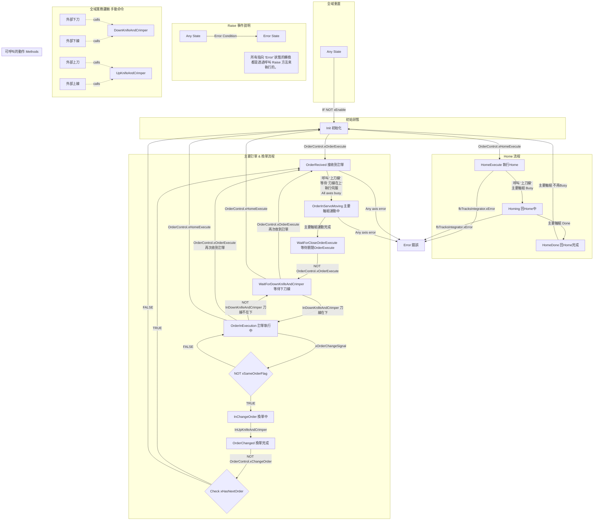

```mermaid
graph TD
    %% -----------------------------------------------------------------
    %% A. 狀態機核心
    %% -----------------------------------------------------------------
    
    %% S1: 初始狀態
    subgraph S1 [初始狀態]
        direction LR
        Init[Init 初始化]
    end

    %% S3: Home 流程
    subgraph S3 [Home 流程]
        HomeExecute[HomeExecute 執行Home]
        Homing[Homing 回Home中]
        HomeDone[HomeDone 回Home完成]
        
        %% 這是被修正的行
        HomeExecute -->|呼叫 '上刀線' 
        主要軸組 Busy| Homing
        Homing -->|主要軸組 Done| HomeDone
        HomeDone -->|主要軸組 不再Busy| Init
    end
    
    %% S2: 主要訂單 & 換單流程
    subgraph S2 [主要訂單 & 換單流程]
        OrderRecived[OrderRecived 接收到訂單]
        OrderInServoMoving[OrderInServoMoving 主要軸組運動中]
        WaitForCloseOrderExecute[WaitForCloseOrderExecute 等待關閉OrderExecute]
        WaitForDownKnifeAndCrimper[WaitForDownKnifeAndCrimper 等待下刀線]
        OrderInExecution[OrderInExecution 訂單執行中]
        InChangeOrder[InChangeOrder 換單中]
        OrderChanged[OrderChanged 換單完成]
        換單相同訂單判斷{NOT xSameOrderFlag}
        CheckNextOrder{Check xHasNextOrder}

        OrderRecived -->|呼叫 '上刀線' 
        等待 '刀線在上' 
        執行伺服 
        All axes busy| OrderInServoMoving
        
        OrderInServoMoving -->|主要軸組運動完成| WaitForCloseOrderExecute
        WaitForCloseOrderExecute -->|NOT OrderControl.xOrderExecute| WaitForDownKnifeAndCrimper
        
        WaitForDownKnifeAndCrimper -->|InDownKnifeAndCrimper 刀線在下| OrderInExecution
        
        OrderInExecution -->|NOT InDownKnifeAndCrimper 刀線不在下| WaitForDownKnifeAndCrimper
        OrderInExecution -->|xOrderChangeSignal| 換單相同訂單判斷
        
        換單相同訂單判斷 --> |TRUE| InChangeOrder
        換單相同訂單判斷 --> |FALSE| OrderInExecution
        
        InChangeOrder -->|InUpKnifeAndCrimper| OrderChanged
        OrderChanged -->|NOT OrderControl.xChangeOrder| CheckNextOrder
        
        %% 循環/重置 箭頭
        CheckNextOrder -->|TRUE| OrderRecived
        CheckNextOrder -->|FALSE| Init
        OrderInExecution -->|OrderControl.xOrderExecute 再次收到訂單| OrderRecived
        WaitForDownKnifeAndCrimper -->|OrderControl.xOrderExecute 再次收到訂單| OrderRecived
        OrderInExecution -->|OrderControl.xHomeExecute| Init
        WaitForDownKnifeAndCrimper -->|OrderControl.xHomeExecute| Init
    end

    %% S1 (Init) 到 S2/S3 的主要觸發
    Init -->|OrderControl.xHomeExecute| HomeExecute
    Init -->|OrderControl.xOrderExecute| OrderRecived

    %% -----------------------------------------------------------------
    %% B. 錯誤 & 全域重置
    %% -----------------------------------------------------------------

    ErrorState[Error 錯誤]
    HomeExecute -->|fbTracksIntegrator.xError| ErrorState
    Homing -->|fbTracksIntegrator.xError| ErrorState
    OrderRecived -->|Any axis error| ErrorState
    OrderInServoMoving -->|Any axis error| ErrorState

    subgraph S4 [全域重置]
        AnyState[Any State]
        AnyState -->|IF NOT xEnable| Init
    end

    subgraph Legend [Raise 事件說明]
        direction LR
        ps[Any State] -->|Error Condition| es[Error State]
        Note["所有指向 'Error' 狀態的轉換 都是透過呼叫 Raise 方法來執行的。"]
    end

    %% -----------------------------------------------------------------
    %% C. 獨立的動作/事件 (不參與主流程)
    %% -----------------------------------------------------------------

    subgraph S5 [全域業務邏輯 手動命令]
        direction LR
        ext_down_k[外部下刀] -.-> |calls| DownKnifeAndCrimper
        ext_down_c[外部下線] -.-> |calls| DownKnifeAndCrimper
        ext_up_k[外部上刀] -.-> |calls| UpKnifeAndCrimper
        ext_up_c[外部上線] -.-> |calls| UpKnifeAndCrimper
    end
    
    subgraph S6 [可呼叫的動作 Methods]
        direction LR
        DownKnifeAndCrimper[DownKnifeAndCrimper]
        UpKnifeAndCrimper[UpKnifeAndCrimper]
    end
```